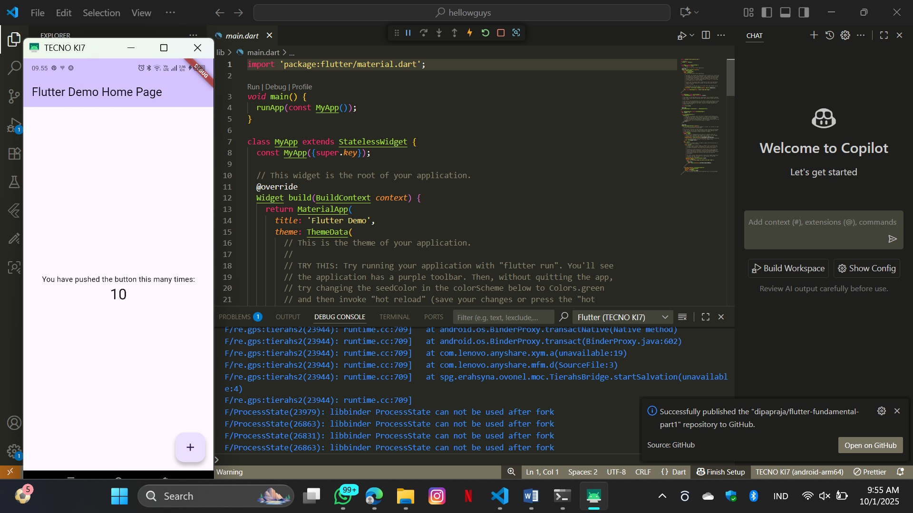

# hellowguys

A new Flutter project.

Praktikum 1
![Lupa screenshot]

Praktikum 2

Gambar ini menunjukkan daftar device dan emulator di VS Code, di mana kamu bisa memilih menjalankan aplikasi Flutter di HP, browser, atau emulator Android.

Praktikum 3

Ini memperlihatkan tampilan awal project Flutter bernama hellowguys yang sudah berhasil dibuat dan menampilkan struktur folder serta log di console.

Praktikum 4

Menampilkan hasil eksekusi project Flutter yang berhasil memunculkan logo Politeknik Negeri Malang pada browser localhost.

Praktikum 5

Memperlihatkan aplikasi Flutter yang menampilkan teks "Contoh button" beserta indikator loading bergaya Cupertino.

Menampilkan aplikasi dengan Floating Action Button berikon jempol warna pink yang ketika ditekan akan memunculkan snackbar berisi pesan.

Menunjukkan aplikasi Counter bawaan Flutter yang berhasil dijalankan dan menampilkan jumlah klik tombol, misalnya angka 3.

Memperlihatkan aplikasi Flutter yang berhasil menampilkan sebuah AlertDialog dengan judul, pesan, dan tombol OK untuk menutupnya.

Menunjukkan aplikasi Flutter yang berisi sebuah TextField sehingga pengguna bisa mengetikkan teks, misalnya nama mereka.

Membuat aplikasi Flutter sederhana yang menampilkan tanggal saat ini, lalu ketika tombol "Pilih Tanggal" ditekan, pengguna bisa memilih tanggal dari Date Picker dan hasil pilihannya langsung ditampilkan di layar.